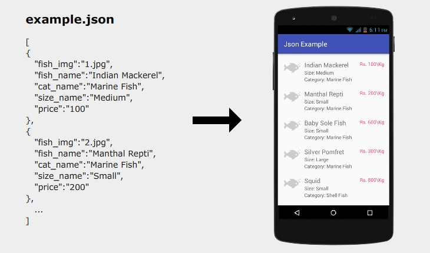

# Fetch JSON data in Android and display with RecyclerView

This tutorial demonstrates how to fetch JSON data in Android and display with RecyclerView. The data may be from JSON file or PHP script. For tutorial  http://androidcss.com/android/fetch-json-data-android/
